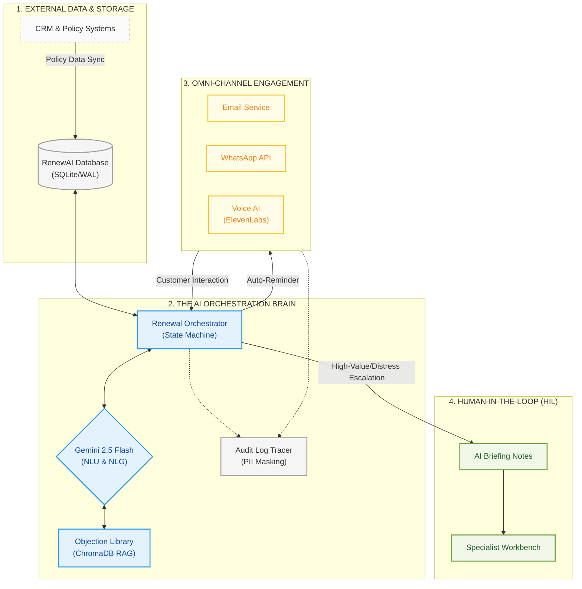

# RenewAI — System Architecture (Flowchart Style)

This document visualizes the end-to-end data and logic flow of the RenewAI platform, from the backend data foundation to the final multi-channel customer engagement.

## 📊 System Flowchart

## 📋 Architectural Layers

### 1. External Data & Storage
The foundation of RenewAI. It synchronizes with legacy CRMs to maintain a "Single Source of Truth" for policy dates, premiums, and customer segments in a secure, high-performance SQLite database.

### 2. The AI Orchestration Brain
The core logic engine. It uses a **Deterministic State Machine** to manage the renewal lifecycle and **Gemini 2.5 Flash** for understanding complex customer intents. The **RAG layer** ensures every response is legally compliant and grounded in vetted insurance facts.

### 3. Omni-Channel Engagement
A multi-modal communication layer. Depending on the customer's "Risk Score" and "Response History," the system dynamically switches between Email, WhatsApp, and low-latency AI Voice calls.

### 4. Human-In-The-Loop (HIL)
The synergy between AI and Human Specialists. When the AI detects "Distress" (emotional hardship) or high-complexity cases, it immediately blocks automated outreach and transfers the file to a human relationship manager with a comprehensive **AI Briefing Note**.

---

> [!TIP]
> This flowchart is designed for stakeholders to understand the "Decision Path" of the autonomous agent. For a technical deep-dive, refer to the [Technical Design Spec](file:///home/labuser/Renew%20ai%2006/DESIGN_SPEC.md).
